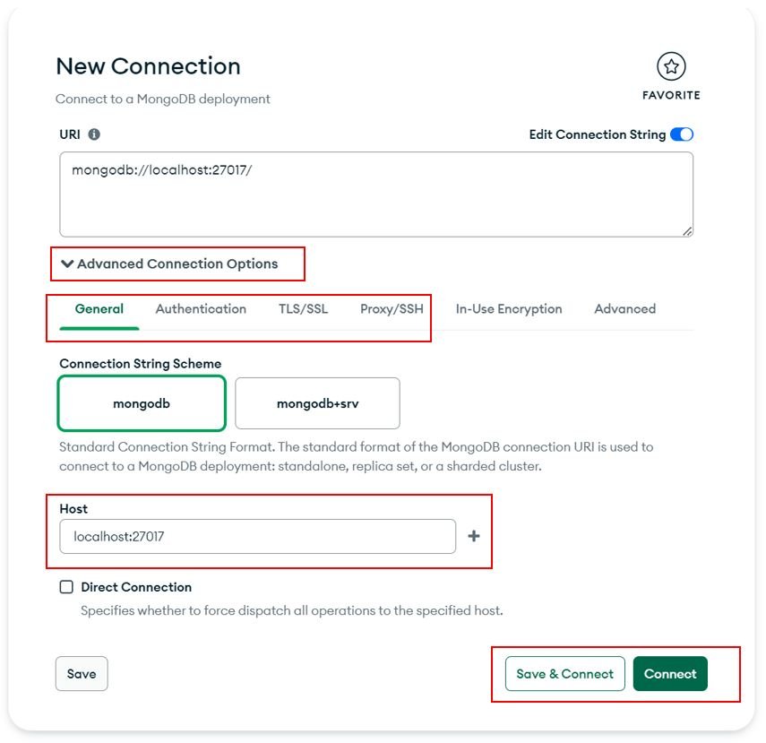
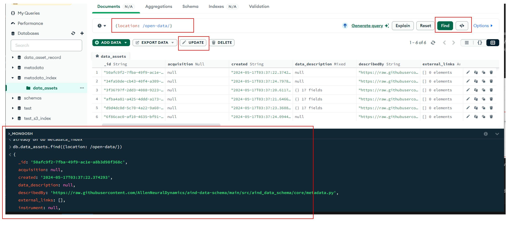

# AIND Metadata Interface
AIND Metadata is stored in our AWS DocumentDB database. This user guide specifies how to connect to, query, and interact with the database.

AIND metadata records describe the `metadata.nd.json` for a data asset.
- Please see [readthedocs for aind-data-schema](https://aind-data-schema.readthedocs.io/en/latest/aind_data_schema.core.html#module-aind_data_schema.core.metadata) for more details.
- `_id`: the unique ID of the data asset.
- `name`: specifies the name of the data asset. Please note this may not be unique across records.
- `location`: specifies the S3 location of the metadata, in the format `s3://{bucket_name}/{name}`.
   - This is unique across records and can be used to query or identify specific records.

There are 2 ways to connect to the DocumentDB. Please use the `metadata_index` database and `data_assets` collection.
1. Connect through MongoDB Compass (desktop application)
2. Connect programmatically in Python. 

## 1. MongoDB Compass
MongoDB Compass is a database GUI that can be used to query and interact with our document database.

### How to connect


1.	Download the full version of [MongoDB Compass](https://www.mongodb.com/try/download/compass)
2.	When connecting, click “Advanced Connection Options” and use the configurations from the list below. Leave any unspecified fields on their default setting.

| Tab            | Config                   | Value                                               |
|----------------|--------------------------|-----------------------------------------------------|
| General        | Host                     | ************.us-west-2.docdb.amazonaws.com          |
| Authentication | Username                 | {database username}                                 |
|                | Password                 | {database password}                                 |
|                | Authentication Mechanism | SCRAM-SHA-1                                         |
| TLS/SSL        | SSL/TLS Connection       | OFF                                                 |
| Proxy/SSH      | SSH Tunnel/ Proxy Method | SSH with Password                                   |
|                | SSH Hostname             | {EC2 IPv4 Address}                                  |
|                | SSH Port                 | 22                                                  |
|                | SSH Username             | {EC2 username}                                      |
|                | SSH Password             | {EC2 password}                                      |

3. You should be able to see the home page with the `metadata-index` database. It should have 1 single collection called `data_assets`.
4. Please change your own database password from the default using the embedded mongo shell in Compass, and then reconnect.
```
db.updateUser(
   "{database username}",
   {
      pwd: passwordPrompt()
   }
)
```
5. Compass Docs: [https://www.mongodb.com/docs/compass/master/connect/advanced-connection-options/](https://www.mongodb.com/docs/compass/master/connect/advanced-connection-options/)

### Interact with AIND Metadata


Within Compass, you can use the UI or the embedded mongo shell to interact with the data.

Please note some features are visible in the UI (e.g. delete) but will not work depending on your user permissions.

Some useful features include:
- Query: Query the database by `_id`, `location`, or any custom set of fields.
   - Regex is supported.
   - Results are can be displayed in JSON or table format.
   - Queries can be saved for later use.
   - Queries can be exported (as a mongo query or in a supported language, e.g. Python).
   - Query results can be exported (downloaded as csv or json).
- Update (some users): Update one or multiple records based on query results.
   - A preview will be shown before you submit the update.
   - An update query can also be saved for later use.
- Mongo shell: Use mongo shell to interact with the data.
- Compass Docs:
   - [https://www.mongodb.com/docs/compass/master/query/filter/](https://www.mongodb.com/docs/compass/master/query/filter/)
   - [https://www.mongodb.com/docs/compass/master/documents/modify/](https://www.mongodb.com/docs/compass/master/documents/modify/)
   - [https://www.mongodb.com/docs/compass/master/embedded-shell/](https://www.mongodb.com/docs/compass/master/embedded-shell/)


## 2. Connect using Python client
We provide a custom client in [aind-data-access-api](https://github.com/AllenNeuralDynamics/aind-data-access-api). 

1. If using credentials from environment, please configure:
```sh
DOC_DB_HOST=docdb-us-west-2-****.cluster-************.us-west-2.docdb.amazonaws.com
DOC_DB_USERNAME=doc_db_username
DOC_DB_PASSWORD=doc_db_password
DOC_DB_SSH_HOST=ssh_host
DOC_DB_SSH_USERNAME=ssh_username
DOC_DB_SSH_PASSWORD=ssh_password
```

2. Usage:

```python
from aind_data_access_api.document_db_ssh import DocumentDbSSHClient, DocumentDbSSHCredentials

# Method 1) if credentials are set in environment
credentials = DocumentDbSSHCredentials()

# Method 2) if you have permissions to AWS Secrets Manager
# Each secret must contain corresponding "host", "username", and "password"
credentials = DocumentDbSSHCredentials.from_secrets_manager(
    doc_db_secret_name="/doc/store/secret/name", ssh_secret_name="/ssh/tunnel/secret/name"
)

with DocumentDbSSHClient(credentials=credentials) as doc_db_client:
    # To get a list of filtered records:
    filter = {"subject.subject_id": "123456"}
    projection = {
        "name": 1, "created": 1, "location": 1, "subject.subject_id": 1, "subject.date_of_birth": 1,
    }
    count = doc_db_client.collection.count_documents(filter)
    response = list(doc_db_client.collection.find(filter=filter, projection=projection))
```

3. More examples: https://github.com/AllenNeuralDynamics/aind-data-access-api/tree/docdb_examples/src/aind_data_access_api/examples